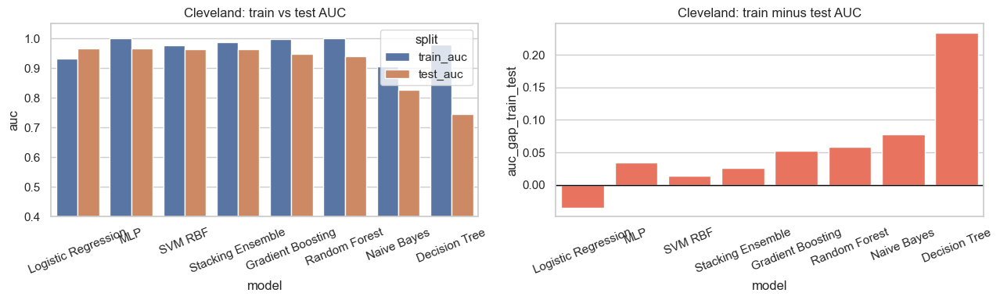
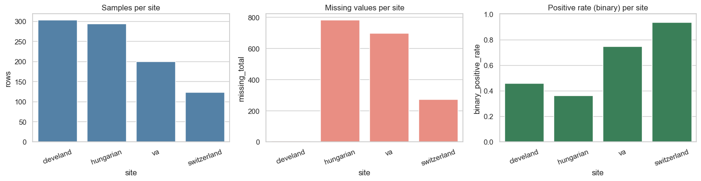
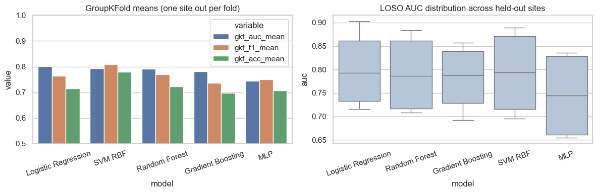
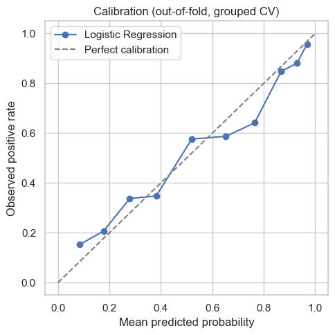

# Prediction of Heart Disease from Clinical Features — Project Report

**Alessandro Carnio · Federico Panico**

**Repository:** [https://github.com/qLessqndr/Prediction-of-Heart-Disease-from-Clinical-Features](https://github.com/qLessqndr/Prediction-of-Heart-Disease-from-Clinical-Features)

---

## Introduction

Our goal is binary classification: we predict heart disease with `target_binary = (num > 0)`. We focus on the presence or not of the disease. Part A uses Cleveland alone. Part B pools all sites so we can see how well a model travels when prevalence, missing values, and severity mix change between hospitals.

## Cleveland baseline

For preprocessing we used median imputation and scaling on `age`, `trestbps`, `chol`, `thalach`, `oldpeak`. For the categorical fields `sex`, `cp`, `fbs`, `restecg`, `exang`, `slope`, `ca`, `thal` we used most-frequent imputation and one-hot encoding. The train/test split is 80/20, stratified. We compared Naive Bayes, logistic regression, a decision tree (max depth 5), random forest (500 trees), gradient boosting, RBF SVM (C = 2), an MLP (64, 32), and a stacking model (LR + RF + SVM with a logistic meta-model and inner five-fold CV).

### Cleveland holdout results

| Model               | Test Accuracy | Test F1 | Test AUC |
|---------------------|---------------|---------|----------|
| Logistic Regression | 0.885         | 0.881   | 0.966    |
| SVM RBF             | 0.902         | 0.897   | 0.964    |
| Stacking Ensemble   | 0.869         | 0.867   | 0.963    |
| Decision Tree       | 0.738         | 0.724   | 0.745    |

**Logistic regression** gets the best **test AUC (0.966)**, so we treat it as our main ranking score on Cleveland. At the same time, **SVM RBF** has the best **test accuracy (0.902)** and **test F1 (0.897)** on the same split. For logistic regression the classification report gives overall accuracy 0.885 and F1 about 0.889 for class 0 and 0.881 for class 1. The right plot shows a large train–test gap for the decision tree (about 0.234), which looks like overfitting.

*Contribution: Alessandro Carnio implemented Cleveland preprocessing and benchmarks; Federico Panico verified splits and overfitting diagnostics.*

## Multicentre data

After merging we have 920 patients. Missing values are not the same everywhere: Cleveland has only 6 missing cells over the 14 inputs; Hungarian has 782; Switzerland 273; VA 698. Positive rates for our binary label also differ a lot: Cleveland 0.459, Hungarian 0.361, Switzerland 0.935, VA 0.745.

*Contribution: Alessandro Carnio merged datasets and pipelines; Federico Panico summarised heterogeneity.*

## Models on all sites and validation

We used the same preprocessing as on Cleveland, plus one-hot encoding for `site`. The models are logistic regression, random forest (500 trees), gradient boosting, RBF SVM (C = 2), and MLP (64, 32). We evaluated them in three ways: (i) a stratified 80/20 holdout on the pooled table; (ii) GroupKFold with `groups = site` and K = 4; (iii) leave-one-site-out with mean, standard deviation, and minimum for AUC and F1.

### Pooled holdout on merged data

| Model               | Accuracy | F1    | AUC   | Brier |
|---------------------|----------|-------|-------|-------|
| Random Forest       | 0.842    | 0.860 | 0.928 | 0.107 |
| Logistic Regression | 0.842    | 0.863 | 0.926 | 0.107 |
| Gradient Boosting   | 0.859    | 0.877 | 0.921 | 0.106 |
| SVM RBF             | 0.853    | 0.874 | 0.914 | 0.108 |
| MLP                 | 0.832    | 0.852 | 0.889 | 0.157 |

### GroupKFold by site (K = 4)

| Model               | Mean AUC | Std AUC | Mean F1 | Mean Acc |
|---------------------|----------|---------|---------|----------|
| Logistic Regression | 0.801   | 0.077   | 0.764   | 0.716    |
| SVM RBF             | 0.793    | 0.085   | 0.810   | 0.779    |
| Random Forest       | 0.791    | 0.078   | 0.770   | 0.723    |
| Gradient Boosting   | 0.781    | 0.067   | 0.736   | 0.697    |
| MLP                 | 0.745    | 0.086   | 0.749   | 0.707    |

On the pooled holdout, the best models reach test AUC around 0.89–0.93. GroupKFold is harder: mean AUC goes from **0.745** for MLP up to **0.801** for logistic regression. If we look at mean F1 and mean accuracy across folds, **SVM** is best (**0.810** and **0.779**); logistic regression still wins on mean AUC.

## LOSO summary, calibration, subgroup errors

### Leave-one-site-out aggregate

| Model               | AUC mean | AUC std | AUC min | F1 mean | F1 min |
|---------------------|----------|---------|---------|---------|--------|
| Logistic Regression | 0.801    | 0.089   | 0.716   | 0.764   | 0.728  |
| SVM RBF             | 0.793    | 0.099   | 0.695   | 0.810   | 0.768  |
| Random Forest       | 0.791    | 0.090   | 0.708   | 0.770   | 0.739  |
| Gradient Boosting   | 0.781    | 0.077   | 0.692   | 0.736   | 0.721  |
| MLP                 | 0.745    | 0.099   | 0.654   | 0.749   | 0.700  |

For calibration we took Logistic Regression (best mean AUC in the LOSO table) and plotted out-of-fold predicted probabilities from GroupKFold. The **Brier score** is **0.1773**; this metric measures how close predicted probabilities are to the true outcomes, where lower values indicate better calibrated predictions. If the curve follows the diagonal, predicted probabilities are roughly honest; large gaps would mean we should not trust raw scores for risk.

We also grouped errors by `age_group` and `sex`. Misclassification is not uniform: for example females in 56–65 (`sex` = 0) reach about 0.21 error rate, and males in 46–55 (`sex` = 1) about 0.18. Young females (≤ 45) have much lower error in our table.

*Contribution: Alessandro Carnio LOSO and calibration; Federico Panico subgroup error analysis.*

## Conclusion

### Summary of main results

| Setting              | Best model (criterion)              | Key number              | Short comment |
|----------------------|-------------------------------------|-------------------------|---------------|
| Cleveland holdout    | Logistic regression (test AUC)      | AUC 0.966               | Best ROC ranking on the Cleveland split we used. |
| Cleveland holdout    | SVM RBF (Acc / F1)                  | Acc 0.902, F1 0.897     | Same split; better accuracy and F1 than logistic regression here. |
| Merged GroupKFold    | Logistic regression (mean AUC)      | 0.801                   | Best when we validate by leaving out whole sites. |
| Merged GroupKFold    | SVM RBF (mean F1, mean Acc)         | F1 0.810, Acc 0.779     | Higher mean F1 than LR (0.764) across folds. |
| Merged LOSO          | SVM RBF (mean F1)                   | F1 mean 0.810           | Same pattern as in GroupKFold for F1. |

Pooled random splits look optimistic compared with GroupKFold and LOSO, which is what we expected when hospitals differ. Logistic regression stays strong on mean AUC when sites move; SVM often wins mean F1 and mean accuracy in grouped validation. Calibration for logistic regression is moderate (Brier 0.1773). In real use we would care about fairness across age and sex, not only average metrics.

---
